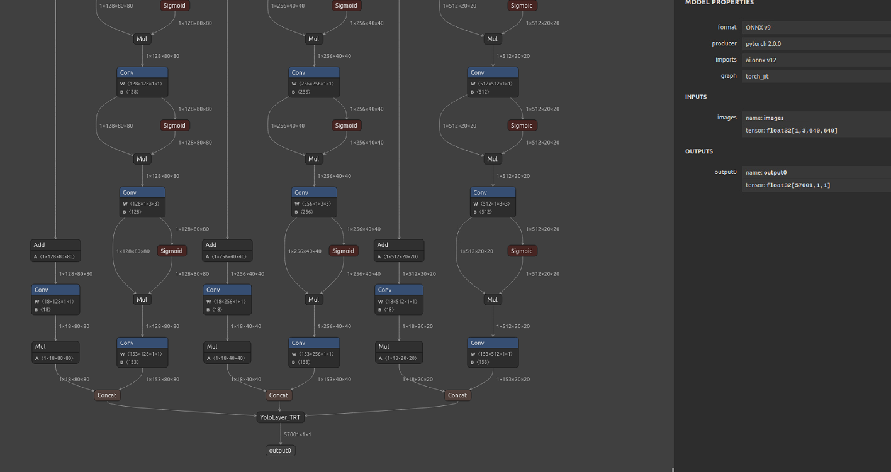

# Yolov7-tiny-pose

## Pose detection base on 
https://github.com/WongKinYiu/yolov7  

https://github.com/nanmi/yolov7-pose  

https://github.com/ICEY22HKU/yolov7-tiny-pose-trt  


## System Environment
Module: Jetson AGX Orin  

Jetpack: 5.0.2 GA  

Python: 3.8.10  

CUDA: 11.4.239  

TensorRT: 8.4.1.5  

OpenCV: 4.5.4 with CUDA: NO  

## Dataset
* Download COCO2017 dataset images ([train](http://images.cocodataset.org/zips/train2017.zip), [val](http://images.cocodataset.org/zips/val2017.zip),  and [labels](https://github.com/WongKinYiu/yolov7/releases/download/v0.1/coco2017labels-keypoints.zip).)
  
## Train
_Note: if your training is interrupted and you want to retrain another one, you had better delete the train_2017.cache and val_2017.cache_
``` shell
python3 train.py --data data/coco_kpts.yaml --cfg cfg/yolov7-tiny-pose.yaml --weights "" --batch-size 32 --img 640 --kpt-label --name yolov7-tiny-pose --hyp data/hyp_pose.yaml  --epoch 300
```

## Test
``` shell
python3 test.py --data data/coco_kpts.yaml --img 960 --conf 0.001 --iou 0.65 --weights best.pt --kpt-label
```

## Deployment
### 1.Export onnx model
#### a.Run exportOnnx.py to generate yolov7-tiny-pose.onnx
```python
import sys
sys.path.append('./')  # to run '$ python *.py' files in subdirectories
import torch
import torch.nn as nn
import models
from models.experimental import attempt_load
from utils.activations import Hardswish, SiLU

# Load PyTorch model
weights = 'yolov7-tiny-pose.pt'
device = torch.device('cuda:0')
model = attempt_load(weights, map_location=device)  # load FP32 model

# Update model
for k, m in model.named_modules():
    m._non_persistent_buffers_set = set()  # pytorch 1.6.0 compatibility
    if isinstance(m, models.common.Conv):  # assign export-friendly activations
        if isinstance(m.act, nn.Hardswish):
            m.act = Hardswish()
        elif isinstance(m.act, nn.SiLU):
            m.act = SiLU()
model.model[-1].export = True # set Detect() layer grid export
model.eval()

# Input
img = torch.randn(1, 3, 960, 960).to(device)  # image size(1,3,320,192) iDetection
torch.onnx.export(model, img, 'yolov7-tiny-pose.onnx', verbose=False, opset_version=12, input_names=['images'])
```

#### b.Use onnxsim command to simplify onnx model.
```shell
# Install onnxsim
pip3 install onnxsim

# Simplify Model
onnxsim yolov7-tiny-pose.onnx yolov7-tiny-pose-sim.onnx
```
 _Note：If not install cmake, it would not work_
```shell
#Install cmake
pip3 install cmake
```

#### c.Visualize the simplified onnx model using netron.


_Note：you must be sure that the output layers in add_custom_yolo_op.py are in alignemnt with the visualization of the model, otherwise：
inputs = [tensors["400"].to_variable(dtype=np.float32),
KeyError: '400'  
      put the simiplified onnx model in YoloLayer_TRT_v7.0/script_
     
run `YoloLayer_TRT_v7.0/script/add_custom_yolo_op.py` then get yolov7-tiny-pose-sim-yolo.onnx visualization:

 


### 2.Generate TensorRT engine
#### a. Build yolo layer tensorrt plugin

```shell
cd {this repo}YoloLayer_TRT_v7.0
mkdir build && cd build
cmake .. && make
```
gain `libyolo.so`

#### b. Build TensorRT engine  
_Note: copy yolov7-tiny-pose-sim-yolo.onnx into YoloLayer_TRT_v7.0/build_
```shell
cd {this repo}/{this repo}/YoloLayer_TRT_v7.0/build

trtexec --onnx=yolov7-tiny-pose-sim-yolo.onnx --fp16 --saveEngine=yolov7-tiny-pose-sim-yolo-fp16.engine --plugins=libyolo.so
```
After a long time, gain the engine 🉑


### 3.Inference  
_Note: modify the CONF_THRESH and IOU_THRESHOLD for your tailored model engine_
a. Static pictures
```shell
python3 picEngineInfer.py  
```


b. Real-time webcam (the output format, (480, 640, 3))
```shell
python3 webcamEngineInfer.py 
```


